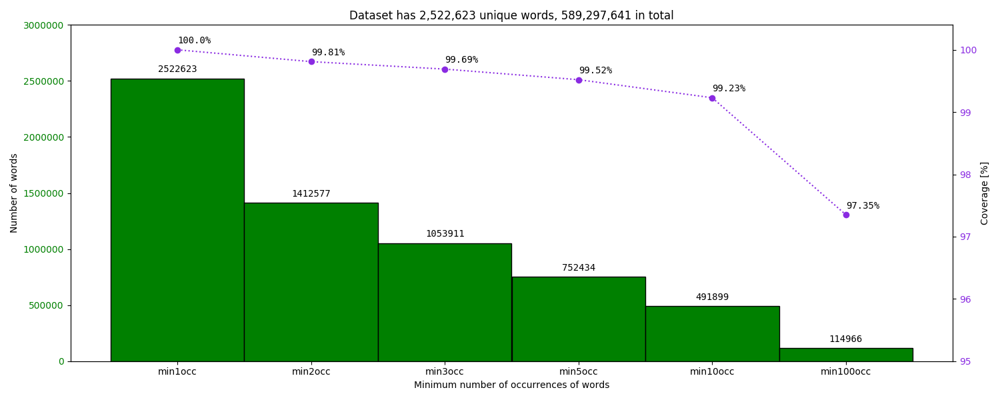
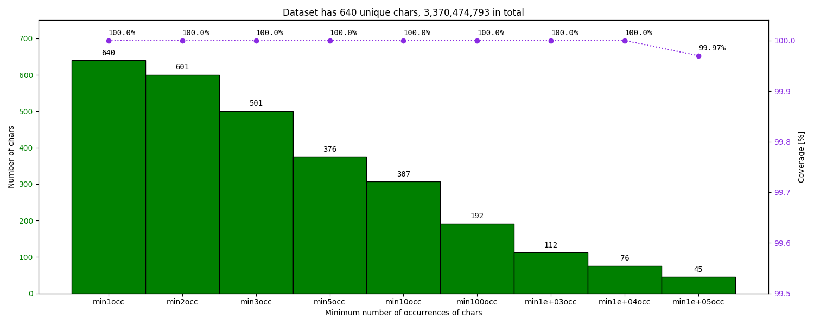

# Automatic query correction & completion project 

## Description

### Define a baseline for query correction

* tokenize text into words (use spacy or a "naive" tokenization)
* use an existing tool for isolated non-word detection and correction (e.g. hunspell)
* rerank candidates by using a probabilistic n-gram language model (LM)

## Usage

### Process wikipedia dumps

Complete process to
* download a .bz2 wikipedia dump file
* decompress the archive
* extract plain text from wikipedia xml file (using the [WikiExtractor.py](https://github.com/attardi/wikiextractor) script)
* split text into sentences and preprocess them
    * lowercase text
    * remove digits
    * remove punctuation marks
    * remove non Latin characters
    * \[*FIXME*\]: uses the external [regex](https://pypi.python.org/pypi/regex/) library, therefore it's quite slow
* count the number of occurrences of tokens (words and characters)
* plot the count and coverage of tokens with respect to a minimum number of occurrences filter
* filter the list of words with respect to their number of occurrences

As a result, this process allows us to define
* a word vocabulary
* the textual corpus needed to train a n-gram LM

```bash
$ scripts/prepare_wikipedia -h
usage: prepare_wikipedia [-h] conf

Download, decompress, extract and clean wikipedia dump data

positional arguments:
    conf        input config file (yml)

optional arguments:
    -h, --help  show this help message and exit
```

### Train n-gram language models

Use the [SRILM](http://www.speech.sri.com/projects/srilm/) toolkit to
* generate n-gram counts based on a word vocabulary and a sentence-per-line corpus
* estimate an open-class language model using the modified Knesser-Ney smoothing technnique

The resulting language model will allow us to compute the log-probability of a sequence of words.

```bash
$ scripts/train_ngram_lm -h
Objective: train a probabilistic n-gram language model

Usage:   scripts/train_ngram_lm <yaml_config_file>
Example: scripts/train_ngram_lm conf/model/config_train_lm_wiki-fr.yml
```

### Build the trie-based version of the SRILM language model

The code was inspired from the [PyNLPl](https://github.com/proycon/pynlpl) library.

Did not use it directly because
* of the long load time
* of the large memory usage (class within a class)
* it always expects an ARPA model (large file, slow parsing)
* it doesn't allow saving the model in a binary file and reloading it from there
* it doesn't handle correctly the start-of-sentence token (prob=-99)

```bash
$ scripts/change_lm_format -h
usage: change_lm_format [-h] conf

Change format of n-gram LM

positional arguments:
  conf        input config file (yml)

optional arguments:
  -h, --help  show this help message and exit
```

### Set up the process for the 1st baseline

Use 3 sources
* a [spacy](https://spacy.io/) NLP model
    * tokenize text
    * detect named entities
    * detect {numbers, urls, emails, punctuation}-like tokens
* the [hunspell](http://hunspell.github.io/) spell-checker
    * detect misspelled words
    * generate candidate corrections (valid words within small edit-distances)
    * requires [two files](https://www.systutorials.com/docs/linux/man/4-hunspell/) ([available sources](https://github.com/hunspell/hunspell/wiki/Dictionary-Packages))
* the trie-based n-gram language model
    * re-rank the out-of-context corrections generated by hunspell
    * prioritize the more likely sequences of words

```bash
$ scripts/run_baseline_1 -h
usage: run_baseline_1 [-h] conf

Tokenize, detect, correct and rerank corrections

positional arguments:
  conf        input config file (yml)

optional arguments:
  -h, --help  show this help message and exit
```

## Docker execution

### Execute: process wikipedia dumps

```bash
$ docker-compose run --rm devel \
    scripts/prepare_wikipedia \
    conf/data/config_download_clean_wiki-fr.yml
```

Configuration

```yaml
---
res: /mnt/data/ml/qwant/datasets/wikipedia/fr-articles/
actions:
  - download
  - decompress
  - extract
  - preprocess
  - plot_word_occurrences
  - define_word_vocabulary
  - plot_char_occurrences
  - define_char_vocabulary
download:
  input: https://dumps.wikimedia.org/frwiki/latest/frwiki-latest-pages-articles.xml.bz2
  output: frwiki-latest-pages-articles.xml.bz2
decompress:
  input: frwiki-latest-pages-articles.xml.bz2
  output: frwiki-latest-pages-articles.xml
extract:
  input: frwiki-latest-pages-articles.xml
  output: frwiki-latest-pages-articles.jsonl
  args:
    - --quiet
    - --json
    - --bytes 30G
    - --processes 2
    - --no-templates
    - --filter_disambig_pages
    - --min_text_length 50
preprocess:
  input: frwiki-latest-pages-articles.jsonl
  output: frwiki-latest-pages-articles.txt
  kwargs:
    ignore_digits: True
    apostrophe: fr
    ignore_punctuation: noise-a
    tostrip: False
    keepalnum: True
plot_word_occurrences:
  input: frwiki-latest-pages-articles.txt
  output: plots/frwiki-latest-pages-articles_words.png
  kwargs:
    mins: [1, 2, 3, 5, 10, 100]
    left_lim: [0, 3000000]
    right_lim: [95, 100.4]
define_word_vocabulary:
  input: frwiki-latest-pages-articles.txt
  output: frwiki-latest-pages-articles_voc-top500k-words.json
  kwargs:
    topn: 500000
plot_char_occurrences:
  input: frwiki-latest-pages-articles.txt
  output: plots/frwiki-latest-pages-articles_chars.png
  kwargs:
    mins: [1, 2, 3, 5, 10, 100, 1000, 10000, 100000]
    left_lim: [0, 750]
    right_lim: [99.5, 100.04]
define_char_vocabulary:
    input: frwiki-latest-pages-articles.txt
    output: frwiki-latest-pages-articles_voc-chars.json
```

Output

```
INFO [2018-04-27 11:01:12,483] [ccquery] Executing download action
INFO [2018-04-27 11:01:12,483] [ccquery.preprocessing.wiki_extraction] Download wikipedia dump
INFO [2018-04-27 11:34:33,892] [ccquery] Executing decompress action
INFO [2018-04-27 11:34:33,892] [ccquery.preprocessing.wiki_extraction] Decompress wikipedia dump
INFO [2018-04-27 11:45:22,892] [ccquery] Executing extract action
INFO [2018-04-27 11:45:22,892] [ccquery.preprocessing.wiki_extraction] Extract plain text from Wikipedia by executing the command:
    WikiExtractor.py \
        frwiki-latest-pages-articles.xml \
        --quiet \
        --json \
        --bytes 30G \
        --processes 2 \
        --no-templates \
        --filter_disambig_pages \
        --min_text_length 50 \
        -o - > frwiki-latest-pages-articles.jsonl
INFO [2018-04-27 13:42:51,790] [ccquery] Executing preprocess action
INFO [2018-04-27 13:42:51,790] [ccquery.preprocessing.wiki_extraction] Extract clean sentences
INFO [2018-04-27 16:16:28,731] [ccquery] Executing plot_word_occurrences action
INFO [2018-04-27 16:22:20,749] [ccquery.preprocessing.vocabulary] Read 2,528,465 words with 591,560,481 occurrences
INFO [2018-04-27 16:22:20,749] [ccquery.preprocessing.vocabulary] Save histogram on word occurrences
INFO [2018-04-27 16:22:23,707] [ccquery] Executing define_word_vocabulary action
INFO [2018-04-27 16:22:34,045] [ccquery.preprocessing.vocabulary] Saved
    500,000 words out of 2,528,465
    (19.77% unique words, 99.24% coverage of word occurrences)
INFO [2018-04-27 16:22:34,133] [ccquery.preprocessing.vocabulary] Save word counts in json file
INFO [2018-04-27 16:22:36,301] [ccquery.preprocessing.vocabulary] Save words in text file
INFO [2018-04-27 16:22:37,226] [ccquery] Executing plot_char_occurrences action
INFO [2018-04-27 16:39:45,466] [ccquery.preprocessing.vocabulary] Read 642 chars with 3,413,985,452 occurrences
INFO [2018-04-27 16:39:45,466] [ccquery.preprocessing.vocabulary] Save histogram on char occurrences
INFO [2018-04-27 16:39:45,783] [ccquery] Executing define_char_vocabulary action
INFO [2018-04-27 16:39:45,783] [ccquery.preprocessing.vocabulary] Save char counts in json file
INFO [2018-04-27 16:39:45,785] [ccquery.preprocessing.vocabulary] Save chars in text file
INFO [2018-04-27 16:39:45,786] [ccquery] Finished.
```

The plot on the word occurrences  


The plot on the character occurrences  


### Execute: train n-gram language models

```bash
$ docker-compose run --rm srilm \
    scripts/train_ngram_lm \
    conf/model/config_train_lm_wiki-fr.yml
```

Configuration

```yaml
---
order: 3
vocab: /mnt/data/ml/qwant/datasets/wikipedia/fr-articles/frwiki-latest-pages-articles_voc-top500k-words.txt
corpus: /mnt/data/ml/qwant/datasets/wikipedia/fr-articles/frwiki-latest-pages-articles.txt
smoothing: -gt1min 0 -kndiscount2 -gt2min 0 -interpolate2 -kndiscount3 -gt3min 0 -interpolate3
pruning: 1e-9
counts: /mnt/data/ml/qwant/models/ngrams/wikipedia/fr-articles/counts_order3_500kwords_frwiki-latest-pages-articles.txt
model: /mnt/data/ml/qwant/models/ngrams/wikipedia/fr-articles/lm_order3_500kwords_modKN_prune1e-9_frwiki-latest-pages-articles.arpa
cleanup: false
```

Output

```bash
Launch n-gram counting
    ngram-count \
        -order 3 \
        -unk -vocab frwiki-latest-pages-articles_voc-top500k-words.txt \
        -text frwiki-latest-pages-articles.txt \
        -sort -write counts_order3_500kwords_frwiki-latest-pages-articles.txt \
        -debug 2

29,751,572 sentences, 591,560,481 words, 4,507,154 OOVs

Finished at 08:56:52, after 515 seconds

Launch LM training
    make-big-lm \
        -order 3 \
        -unk -read counts_order3_500kwords_frwiki-latest-pages-articles.txt \
        -name aux -lm lm_order3_500kwords_modKN_prune1e-9_frwiki-latest-pages-articles.arpa \
        -gt1min 0 -kndiscount2 -gt2min 0 -interpolate2 -kndiscount3 -gt3min 0 -interpolate3 \
        -prune 1e-9 \
        -debug 2

using ModKneserNey for 1-grams
using ModKneserNey for 2-grams
using ModKneserNey for 3-grams
warning: distributing 0.000334545 left-over probability mass over all 500002 words

discarded       1 2-gram contexts containing pseudo-events
discarded  453588 3-gram contexts containing pseudo-events

pruned    3298081 2-grams
pruned   90388561 3-grams

writing    500003 1-grams
writing  34985400 2-grams
writing  64759795 3-grams

Finished at 09:45:28, after 2916 seconds

Generated a model of 2.9G
```

### Execute: build the trie-based version of the SRILM language model

```bash
$ docker-compose run --rm devel \
    scripts/change_lm_format \
    conf/model/config_train_lm_wiki-fr.yml
```

Configuration
* use the same configuration file as the *train_ngram_lm* script
* only uses the 'model' path configuration

Output
```
INFO [2018-05-14 10:06:54,736] [ccquery] Load ARPA model
INFO [2018-05-14 10:06:54,737] [ccquery.ngram.arpa_lm] Load ARPA model from
    lm_order3_500kwords_modKN_prune1e-9_frwiki-latest-pages-articles.arpa
INFO [2018-05-14 10:06:54,737] [ccquery.ngram.arpa_lm] Processing 1-grams
INFO [2018-05-14 10:06:56,478] [ccquery.ngram.arpa_lm] Processing 2-grams
INFO [2018-05-14 10:08:53,070] [ccquery.ngram.arpa_lm] Processing 3-grams
INFO [2018-05-14 10:12:35,282] [ccquery.ngram.arpa_lm] Loaded a 3-gram LM with {1: 500003, 2: 34985400, 3: 64759795} counts
INFO [2018-05-14 10:25:30,647] [ccquery.ngram.arpa_lm] Finished storing n-grams under trie structure
INFO [2018-05-14 10:29:43,979] [ccquery] Build and save trie-based n-gram model
INFO [2018-05-14 10:29:43,980] [ccquery.ngram.arpa_lm] Store trie-based n-grams under binary format in
    lm_order3_500kwords_modKN_prune1e-9_frwiki-latest-pages-articles.bin
INFO [2018-05-14 10:29:44,726] [ccquery] Generated a model of 873.1MB
```

### Execute: set up the process for the 1st baseline

```bash
$ docker-compose run --rm devel \
    scripts/run_baseline_1 \
    conf/model/config_baseline_1.yml
```

Configuration

```yaml
---
spacy:
  model: fr_core_news_sm
  disable:
    - ner
    - parser
ngram:
  model: /mnt/data/ml/qwant/models/ngrams/wikipedia/fr-articles/lm_order3_500kwords_modKN_prune1e-9_frwiki-latest-pages-articles.bin
  kwargs:
    order: 3
    header: '@dd'
hunspell:
  dic: /mnt/data/ml/qwant/datasets/dictionaries/hunspell/FR/fr_plus_frwiki-latest-pages-articles_voc-top500k-words.dic
  aff: /mnt/data/ml/qwant/datasets/dictionaries/hunspell/FR/fr.aff
evaluate:
  data:
    file: /src/tests/spelling/sample-queries.jsonl
    input: noisy
    target: clean
  top:
    - 10
    - 5
    - 1
```

Note:
* the combined dictionary 'fr_plus_frwiki-latest-pages-articles_voc-top500k-words.dic'  
  was obtained with the [combine_dictionaries](scripts/combine_dictionaries) script  
  and the [config_combine_dictionaries.yml](conf/data/config_combine_dictionaries.yml) configuration
* it combines the [fr.dic](https://packages.debian.org/sid/all/hunspell-fr-revised/download) hunspell dictionary  
  with the vocabulary associated to the n-gram language model

Output
```
INFO [2018-05-14 10:47:46,732] [ccquery] Load intermediate tools
INFO [2018-05-14 10:47:58,509] [ccquery.spelling.b1correction] Loaded spacy NLP model
INFO [2018-05-14 10:47:59,096] [ccquery.spelling.b1correction] Loaded hunspell checker
INFO [2018-05-14 10:47:59,634] [ccquery.spelling.b1correction] Loaded n-gram language model
INFO [2018-05-14 10:47:59,634] [ccquery] Launch correction
INFO [2018-05-14 10:47:59,634] [ccquery] Evaluating the top 10 candidate corrections
INFO [2018-05-14 10:48:19,955] [ccquery] Performance R@10=88.67, P@10=81.93, F1@10=85.17
INFO [2018-05-14 10:48:19,956] [ccquery] Evaluating the top 5 candidate corrections
INFO [2018-05-14 10:48:40,253] [ccquery] Performance R@5=88.67, P@5=82.27, F1@5=85.35
INFO [2018-05-14 10:48:40,254] [ccquery] Evaluating the top 1 candidate corrections
INFO [2018-05-14 10:49:00,630] [ccquery] Performance R@1=86.33, P@1=86.33, F1@1=86.33
INFO [2018-05-14 10:49:00,630] [ccquery] Debugging...
INFO [2018-05-14 10:49:20,996] [ccquery] Display top-1 corrections
FROM           comment rehoindre une force TO  comment rejoindre une force
FROM            meilleur voeu en portugais TO  meilleur voeu en portugais
FROM                    serrue en applique TO  serre en applique
FROM                  pain de mie japonaid TO  pain de mie japonais
FROM                    dance polynesienne TO  dance polynésienne
FROM               caf aide longue malades TO  caf aide longue malades
FROM                             tanquille TO  tranquille
FROM                               malives TO  malines
FROM                             cinforama TO  informa
FROM                   ouvrir une huitemre TO  ouvrir une huitre
FROM  dtatistiques recherches sur internet TO  statistiques recherches sur internet
FROM                  conversion grammique TO  conversion muramique
FROM                    la lione chanteuse TO  la lione chanteuse
FROM                 paroles alumer le feu TO  paroles allumer le feu
FROM  fin grossesse glande bartolin enflée TO  fin grossesse glande bartoli enflée
FROM              dernier empreur de chine TO  dernier empereur de chine
FROM          comboien rapporte un codebis TO  colombien rapporte un debis
FROM                       musique vietman TO  musique vietnam
FROM                              amstrong TO  armstrong
FROM              je msuis fait tout petit TO  je suis fait tout petit
...
```
